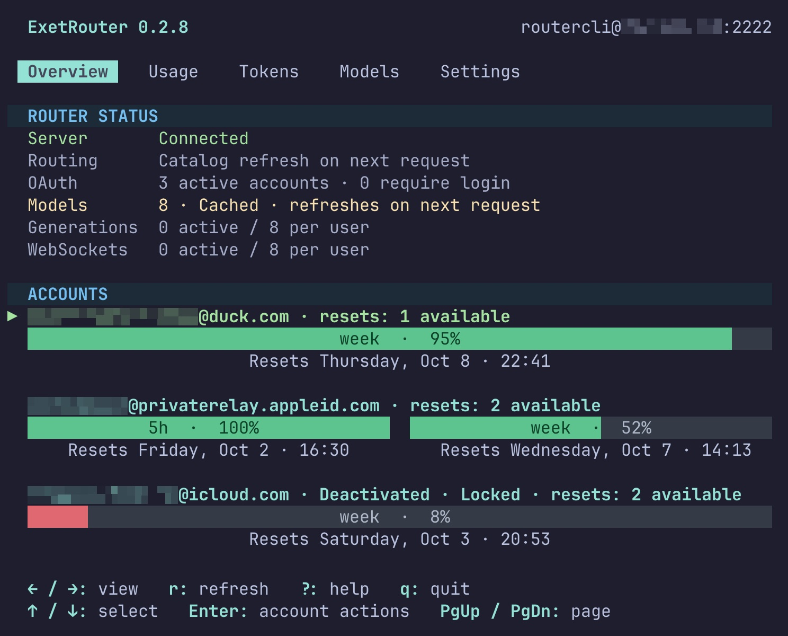

<h1 align="center">ExetRouter</h1>

<p align="center">
  Your ChatGPT subscriptions, one shared OpenAI-compatible endpoint.
</p>

<p align="center">
  
</p>

Turn your **ChatGPT Plus or Pro subscription into a shared OpenAI-compatible endpoint** for friends, BYOK tools and scripts. Give each person or service their own router token, keep your ChatGPT login private, and see usage grouped by user in the terminal dashboard. Run it locally for your own tools or host it on a server you control.

Codex CLI already supports ChatGPT subscriptions directly. ExetRouter adds a common endpoint for multiple people and tools, separate access tokens and shared account-pool management. Sign in to upstream accounts once through OAuth; clients receive router tokens instead of your ChatGPT credentials. Supported requests use the subscriptions' available limits rather than a separately billed OpenAI Platform API key.

## How it works

- **`exr`** opens the terminal dashboard: accounts, tokens, usage, subscription limits and settings. Choose **Standalone** and add an OAuth account for personal use — no server or SSH setup required.
- **`exr serve`** keeps the standalone API running without a dashboard.
- **`exrd`** runs a shared server, with Docker or native deployment. Friends configure `exr` once to connect over restricted SSH; private SSH keys stay on their devices.

## Install

Install `exr` to run locally or connect to a shared server.

### Linux

Download and run the binary installer. It selects your architecture and verifies the release checksum; Rust is not required:

```sh
curl --fail --location --proto '=https' --tlsv1.2 \
  https://raw.githubusercontent.com/mocki-toki/exetrouter/main/scripts/install.sh -o /tmp/exetrouter-install.sh
sh /tmp/exetrouter-install.sh --role client
~/.local/bin/exr
```

The client is installed in `~/.local/bin`. Add that directory to your `PATH` to launch it as `exr`. See [installation details](docs/installation.md#release-binaries-on-linux-or-macos) for version selection, custom paths and older Linux systems.

### macOS

Install with Homebrew:

```sh
brew tap mocki-toki/exetrouter https://github.com/mocki-toki/exetrouter
brew install mocki-toki/exetrouter/exr
exr
```

### Build from source

Use Rust 1.88 or newer and a C compiler:

```sh
cargo install --locked --git https://github.com/mocki-toki/exetrouter --bin exr
exr
```

## Remote Server

Run `exrd` on a server to share your ChatGPT account pool with friends, tools and services. Each person gets their own access and tokens; OAuth accounts stay on the server. Users install `exr` on their devices and choose **Remote Server** in the first-run wizard. The dashboard connects over restricted SSH, while applications use the shared HTTPS API endpoint.

Choose a server installation:

- [Docker Compose](deploy/docker/README.md) — the recommended setup, using ready-made Linux AMD64/ARM64 images.
- [Native server](deploy/README.md) — run `exrd` directly with systemd, OpenSSH and a TLS reverse proxy.

## Usage

### Set up ExetRouter

Run `exr`. On the first launch, the wizard asks how you want to use it:

- **Standalone:** manage your own accounts and run the API on this computer. Open **Settings**, add an account and complete the OAuth sign-in in your browser. The default API endpoint is `http://127.0.0.1:8787/v1`; Settings shows the actual address. Keep the dashboard open, or use `exr serve` for a headless API.
- **Remote Server:** connect to an existing shared server. Enter the SSH host, port, username and private-key path in the wizard. Ask the operator to register your public key, provide a verified SSH host key and give you the HTTPS API endpoint. SSH is for the dashboard; Codex, OpenCode and SDKs use the API endpoint.

You can change mode or connection later in **Settings**. No shell alias or connection flags are needed.

In **Tokens**, create a token for the tool you want to connect. Its secret is copied directly to your clipboard. You need the **API endpoint and router token** to connect. For tools that ask for a model ID, choose one in **Models** and press Enter to copy it; Codex can select a model interactively.

Store the token in your password manager or service secret store. For the examples below, expose it to the client process as `EXETROUTER_TOKEN`. In Bash or Zsh, this reads a pasted token without displaying it or putting it in shell history:

```sh
printf 'Paste router token: '
read -rs EXETROUTER_TOKEN
printf '\n'
export EXETROUTER_TOKEN
```

Use `http://127.0.0.1:8787/v1` for the default standalone setup. For remote access, replace `https://api.example.com/v1` in the examples with the HTTPS endpoint your operator supplied. Where an example uses `MODEL_ID`, replace it with the model copied from **Models**.

### Codex CLI

Use Codex CLI **0.160.0 or newer**. Create `~/.codex/exetrouter.config.toml` with the following settings. Profiles use separate files; do not put this inside a `[profiles.exetrouter]` table in `config.toml`.

```toml
model_provider = "exetrouter"

[features]
api_key_model_discovery = true

[model_providers.exetrouter]
name = "OpenAI"
base_url = "https://api.example.com/v1"
model_catalog_url = "https://api.example.com/v1/models/codex"
wire_api = "responses"
env_key = "EXETROUTER_TOKEN"
supports_websockets = true
request_max_retries = 0
stream_max_retries = 0
```

Replace both URLs with your router's address. For standalone use, they are `http://127.0.0.1:8787/v1` and `http://127.0.0.1:8787/v1/models/codex`.

Start `codex --profile exetrouter` from the terminal where the token is available. Codex fetches model IDs and metadata from the router; no catalog export or fixed `model` setting is needed. It inherits your existing model preference, or chooses a catalog default if none is configured. Use `/model` to choose another model available in your pool. Keep the provider name `OpenAI` for native compaction. Automatic catalog discovery is an opt-in Codex feature, marked under development in 0.160.0.

OpenCode V1 1.18.34 has a separate HTTP/SSE bridge with mock tool/resume and error no-replay checks. See [V1 setup and measured limitations](docs/compatibility.md#opencode-v1-check-2026-10-03) before using it.

### OpenCode V2

Use the bundled bridge plugin with the tested OpenCode V2 client. If you installed only the binary, download the repository for the plugin:

```sh
git clone https://github.com/mocki-toki/exetrouter.git
exr models --json --format opencode-jsonc > exetrouter-models.json
```

Merge this into your OpenCode `opencode.jsonc`, preserving existing providers and plugins. Replace the plugin path with the absolute path to `clients/opencode/exetrouter` in your checkout:

```jsonc
{
  "$schema": "https://opencode.ai/config.json",
  "plugins": ["/absolute/path/exetrouter/clients/opencode/exetrouter"],
  "providers": {
    "exetrouter": {
      "name": "ExetRouter",
      "canonical": "openai",
      "package": "@opencode/ai/providers/openai/responses",
      "env": ["EXETROUTER_TOKEN"],
      "settings": {
        "baseURL": "https://api.example.com/v1",
        "transport": "websocket",
        "store": false,
        "compaction": {"type": "native"}
      },
      "models": {"MODEL_ID": {}}
    }
  }
}
```

Replace the `models` object with `providers.exetrouter.models` from the exported `exetrouter-models.json`; it supplies context limits, capabilities and reasoning variants. Start OpenCode from the terminal where the token is available and select `exetrouter/MODEL_ID`. The bridge removes unsupported output-token caps and disables this provider's session retry hook. These settings target **OpenCode V2**, not V1; see the [compatibility matrix and configuration](docs/compatibility.md#opencode-v2).

### OpenAI SDKs and other BYOK tools

For a BYOK app, choose a custom OpenAI-compatible endpoint, enter your router token as the API key and select the model ID from **Models**. The app must use a [supported endpoint](docs/openai-api.md).

For Python, install `openai` and create a client with your endpoint and router token:

```python
import os
from openai import OpenAI

client = OpenAI(
    base_url="http://127.0.0.1:8787/v1",
    api_key=os.environ["EXETROUTER_TOKEN"],
    max_retries=0,
)
response = client.responses.create(
    model="MODEL_ID",
    input="Hello!",
    store=False,
)
print(response.output_text)
```

For JavaScript, install `openai` and use the same values:

```javascript
import OpenAI from "openai";

const client = new OpenAI({
  baseURL: "http://127.0.0.1:8787/v1",
  apiKey: process.env.EXETROUTER_TOKEN,
  maxRetries: 0,
});
const response = await client.responses.create({
  model: "MODEL_ID",
  input: "Hello!",
  store: false,
});
console.log(response.output_text);
```

Retries are disabled because a generation may have run even if its response was lost. Responses, streaming and supported Chat Completions share the endpoint; see the [SDK/API contract](docs/openai-api.md) for parameters and limitations.

## Privacy and scope

- The router does **not log or store prompts, messages, outputs, tool arguments/results, authorization headers or request/response bodies**. Operational logs contain fixed events, generated IDs, statuses and timing; usage stores model IDs and numeric counters. Context bindings store keyed digests, not conversation content. See [privacy details](SECURITY.md).
- A proxy necessarily processes content in memory. This is not end-to-end encryption against an operator who controls the host or can replace its software. The project provides no conversation-history or payload-inspection admin feature.
- Upstream uses ChatGPT Codex OAuth. OpenAI Platform API keys are not upstream credentials. BYOK applications can use a router bearer and your deployment's custom endpoint within the supported API contract.
- Opaque context and open WebSockets stay on their originating account. The router never silently migrates an existing conversation or retries a possibly submitted inference request.
- Management uses restricted SSH and an authenticated Unix socket; there is no public HTTP admin endpoint. Resource concurrency protects the process; per-minute/IP quotas are not imposed.
- Compatibility is not an official guarantee of backend stability or permission to share subscriptions. Operators are responsible for their provider agreements.

## Develop

```sh
cargo test --locked
cargo fmt --check
cargo clippy --locked --all-targets -- -D warnings
python3 scripts/check-publication.py
```

Ordinary tests are offline and use synthetic fixtures. Live tests are explicitly opt-in; they spend subscription quota and must not run in CI. The separate [exr skill](skills/exr/SKILL.md) and [exrd skill](skills/exrd/SKILL.md) document client/standalone and server operation. See [contributing](CONTRIBUTING.md) and [the roadmap](docs/development-plan.md).

[Client CLI/TUI](docs/cli.md) · [Server CLI](docs/server-cli.md) · [API contract](docs/openai-api.md) · [Client compatibility](docs/compatibility.md) · [Architecture](docs/architecture.md) · [Model metadata](docs/model-catalog.md) · [Account pool](docs/account-pool.md) · [Backup](docs/backup.md) · [Upstream contract](docs/upstream-contract.md)

## License

[MIT](LICENSE). Rust dependencies retain their own licenses.

## Star History

<a href="https://www.star-history.com/?repos=mocki-toki%2Fexetrouter&type=date&legend=top-left">
  <picture>
    <source media="(prefers-color-scheme: dark)" srcset="https://api.star-history.com/chart?repos=mocki-toki/exetrouter&type=date&theme=dark&legend=top-left" />
    <source media="(prefers-color-scheme: light)" srcset="https://api.star-history.com/chart?repos=mocki-toki/exetrouter&type=date&legend=top-left" />
    
  </picture>
</a>
